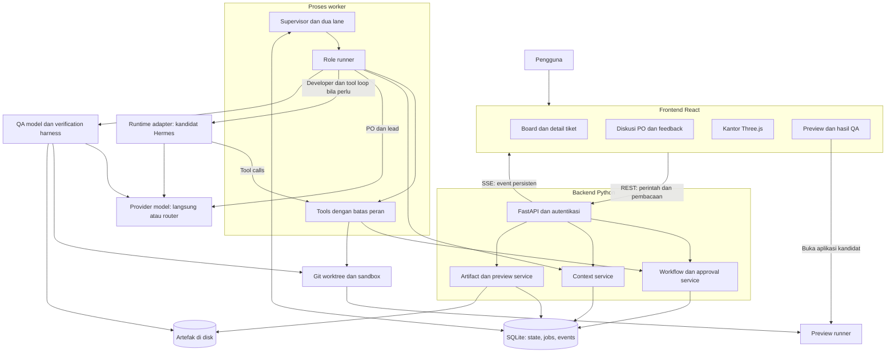
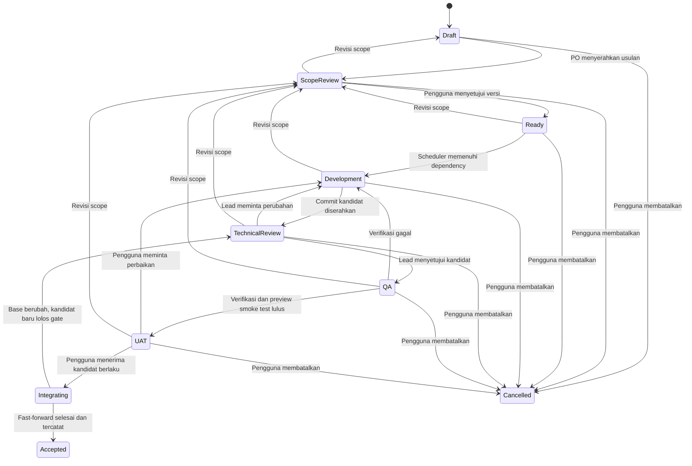
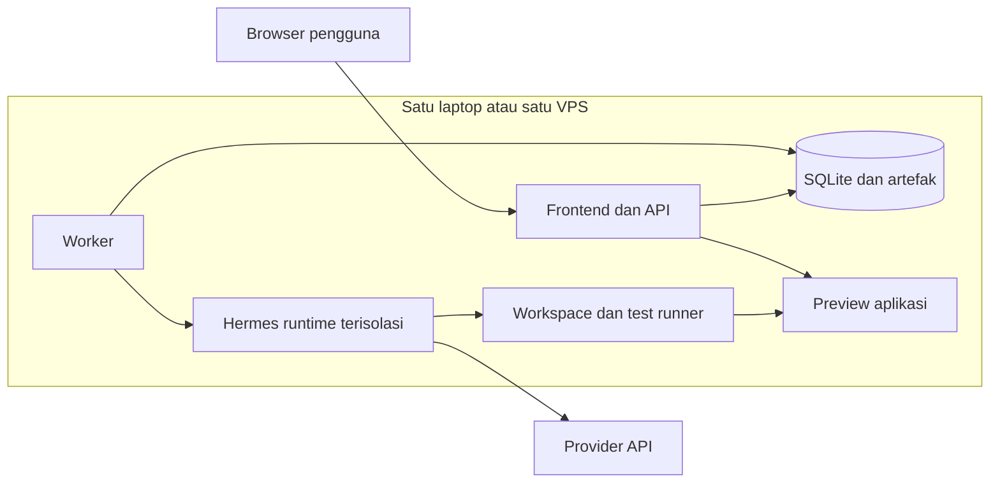

# Arsitektur AI Software Development Team

Status: spesifikasi implementasi MVP; sistem belum dibangun.
Tanggal: 4 Oktober 2026. Revisi: 3, setelah review dalam verdict.md dan verdit2.md.
Kebutuhan produk: [MVP-BLUEPRINT.md](./MVP-BLUEPRINT.md).
Urutan implementasi dan acceptance criteria: [IMPLEMENTATION-BACKLOG.md](./IMPLEMENTATION-BACKLOG.md).
Panduan AI pelaksana: [AGENTS.md](./AGENTS.md).
Setup dan checkpoint code review: [DEVELOPMENT-WORKFLOW.md](./DEVELOPMENT-WORKFLOW.md).

## 1. Bentuk sistem

Gunakan **modular monolith**: satu backend dengan modul domain yang terpisah,
satu proses worker untuk pekerjaan panjang, dan satu frontend web. Empat peran
agent adalah identitas, konteks, tools, dan konfigurasi eksekusi, bukan empat
microservice yang wajib hidup terus. Worker memiliki dua lane: interactive dan
execution, dengan supervisor yang tidak terblokir oleh satu run panjang.

Backend kita memiliki workflow dan persetujuan. PO/lead mulai dengan panggilan
model terstruktur dan tools terbatas; developer memakai runtime tool loop;
QA menggunakan model dan harness pengujian. Hermes adalah kandidat executor
di belakang adapter, dipilih setelah spike. Database produk menjadi acuan state
dan konteks proyek. Runtime hanya menyimpan sesi terisolasi yang diperlukan.



Panah ke modul adalah hubungan logis. Worker memakai modul aplikasi/repository
yang sama untuk pekerjaan internal; agent mengaksesnya melalui tool facade.
Frontend tidak terhubung langsung ke provider model, database, atau Hermes.

## 2. Stack dan batas deployment

| Bagian | Pilihan MVP | Alasan |
| --- | --- | --- |
| Frontend | React, Vite, TypeScript | Board, chat, dan kantor dalam satu aplikasi |
| Kantor virtual | Three.js + React Three Fiber, tahap lanjut | Scene mengikuti event nyata |
| Backend | Python + FastAPI | API aplikasi dan adapter runtime Python |
| Database | SQLite di disk lokal, WAL, foreign keys | Operasional sederhana untuk satu host |
| Migrasi database | SQLAlchemy + Alembic | Schema dan migrasi dapat dilacak |
| Job queue | Tabel jobs + worker polling | Job bertahan setelah restart |
| Pembaruan UI | REST + SSE | Perintah lewat REST, aktivitas lewat stream |
| Peran ringan | Model client + output schema + tools terbatas | PO/lead tidak wajib full runtime |
| Developer runtime | Kandidat Hermes adapter, versi dipin | Pilihan diputuskan setelah spike |
| Pengujian workflow | Fake provider dengan respons skrip berlabel | Memeriksa domain tanpa provider |
| File dan build | Direktori artefak di disk | Database menyimpan metadata dan referensi |
| Kode proyek | Clone managed + worktree per attempt | Repo asli terpisah dari executor |
| QA web | Harness + test runner repo + Playwright | Hasil eksekusi dicatat program |
| Lingkungan eksekusi | Container per attempt | Pisahkan kode target dari control backend |

SQLAlchemy/Alembic adalah pilihan implementasi, bukan syarat provider agent.
Redis, vector database, dan Kubernetes belum diperlukan pada MVP.

Stack target pilot: React/Vite untuk proyek referensi. Repo existing memakai
runner manifest yang divalidasi: install/build/test/start commands, toolchain,
port, fixtures, dan migration checks bila relevan. Dukungan stack lain ditambahkan
melalui runner terverifikasi, bukan klaim deteksi otomatis semua framework.
Mobile development memakai runner berbeda pada tahap berikutnya.

SQLite WAL mendukung pembaca bersamaan dengan penulis, tetapi tetap satu penulis
pada suatu waktu. Gunakan transaksi singkat dan busy timeout; tidak menahan
transaksi selama menunggu LLM. Database WAL harus berada di host yang sama,
bukan filesystem jaringan. [Dokumentasi SQLite](https://sqlite.org/wal.html)

## 3. Modul backend

| Modul | Tanggung jawab |
| --- | --- |
| Projects/context | Brief, onboarding, runner manifest, konteks, decisions |
| Tickets/workflow | Tiket, UAC, dependency, approval scope/UAT, revisions |
| Messages/events | Thread nyata, klarifikasi, audit, replay SSE |
| Jobs/agents | Dua lane, claim, supervisor, role runner, runtime adapter |
| Workspace/integration | Clone managed, worktree attempt, accepted ref, recovery |
| Verification/preview | Harness, evidence, fixture database, preview on-demand |
| Releases | Record scope/commit, regression dan keputusan; fungsi dalam workflow |

Aturan domain ditempatkan pada services, sehingga REST, tool calls, dan
connector board tidak memiliki implementasi approval yang berbeda. Connector
belum menjadi modul implementasi MVP. Tabel di atas membatasi area tanggung jawab,
bukan tujuh service deployment.

## 4. Workflow dan hak aktor



`phase` tiket terpisah dari `execution_state` job. Tiket bisa tetap di QA ketika
job menunggu quota. Kondisi blocked mempunyai reason/resolution dan tidak
menyebabkan tiket dianggap selesai. `Ready` berarti disetujui, sedangkan
eligibility eksekusi juga memeriksa dependency, budget, dan kapasitas.

| Aksi | Aktor yang berwenang | Syarat |
| --- | --- | --- |
| Usulkan/revisi tiket | PO atau pengguna | Membuat versi kebutuhan baru |
| Setujui scope | Pengguna | Versi tiket/UAC belum berubah sejak review |
| Mulai implementasi | Scheduler | Scope disetujui dan dependency terpenuhi |
| Serahkan kode | Developer | Commit dan artefak dapat diperiksa |
| Setujui technical review | Lead | Mengacu ke kandidat dan versi UAC yang tepat |
| Ajukan UAT | Verification service setelah QA | Bukti valid dan preview sudah lolos smoke test |
| Terima UAT | Pengguna | Kandidat/revision/base masih berlaku; memulai integrasi |
| Integrasikan penerimaan | Integrator | Update accepted ref sukses sebelum status Accepted |
| Setujui release | Pengguna | Build gabungan sudah diverifikasi |

Setiap mutation membawa `expected_revision`. Jika tiket berubah, API mengembalikan
conflict agar UI membaca ulang. Persetujuan batch bersifat all-or-nothing dan
mencatat versi masing-masing tiket, bukan boolean pada proyek. Validasi dependency
referensinya ada dan graph tidak siklik. Dependency yang belum disetujui memberi
peringatan dan membuat tiket belum eligible, bukan melarang review scope terpisah.

Untuk MVP, dependency kode hanya terpenuhi oleh kandidat accepted yang sudah
diintegrasikan. Ini berarti pekerjaan yang bergantung pada fitur tersebut menunggu
UAT pengguna. Tiket independen dapat berjalan selama UAT; kandidatnya mungkin
perlu diselaraskan ulang jika accepted ref bergerak.

Perubahan UAC saat eksekusi mencabut eligibility versi lama. Worker dihentikan
atau diminta berhenti; hasil lama tidak boleh memajukan versi tiket baru.
Penambahan kebutuhan di UAT menjadi revisi scope/tiket tambahan melalui PO.
Revisi kembali ke Scope Review; hasil versi lama tidak mengaktifkan versi baru.
PO mengusulkan revisi/diff dan klasifikasi feedback; pengguna mengonfirmasi
perubahan UAC. Bug dalam UAC yang sama cukup masuk request-changes.

Cancelled menghapus eligibility dan mencabut run aktif. Histori tetap tersimpan.
Untuk tiket accepted, perubahan/revert adalah tiket baru. Operasi Integrating
harus direkonsiliasi sebelum cancel/revisi baru; jangan mengubah ref setengah jalan.

Default: maksimal tiga siklus review/QA/perbaikan per scope version; setelah itu
blocked: needs_human. Satu retry transient per job terpisah dari batas siklus.
Pengguna dapat melanjutkan setelah membaca kegagalan, tanpa menghapus attempt history.
Kesalahan kontrak selector yang didiagnosis runner ditangani di QA. Koreksi
selector yang konservatif membuat suite/target baru pada build yang sama dan
menjalankan baseline/kandidat ulang. Ini tidak menaikkan repair_cycles aplikasi;
ketidakjelasan diagnosis tetap incomplete/failed, bukan pass.

Policy QA ringan memakai capability/preflight sebelum development dan pemetaan
automated/manual dari scope yang disetujui. Rencana kecil menggabungkan UAC
dalam beberapa journey tanpa menghapus coverage atau gates. Failure browser
yang belum memenuhi koreksi konservatif dikirim ke job QA diagnosis persisten
pada target/evidence yang sama, sehingga retry model tidak mengulang harness.
Hanya application fault yang terdiagnosis meminta repair. Test/unknown tetap
di QA; koreksi CSV dari input asli, selector text legacy yang terbukti invalid,
dan setup dari prefix tes lulus tetap memerlukan target dan eksekusi baru.
Model setup hanya memilih indeks tindakan existing, tanpa mengubah assertion;
supervisor memvalidasi sumber fixture, penempatan, coverage, lease dan target.
Fixture UI bernama diekspansi supervisor ke setiap context terisolasi sebelum
suite canonical dipin. Select mode wajib eksplisit; relasi record dinamis memakai
label input asli. Binding yang dikoreksi harus didukung opsi nyata dari runner,
bukan ID dugaan. Diagnosis application memerlukan UAC dan kutipan source shipped
yang cocok persis; kontrak ambigu tanpa bukti tidak mengirim repair ke developer.
Runner upgrade hanya mem-refresh target review_approved yang masih di QA dengan
source/build/config/base tetap; bukti lama immutable dan QA penuh wajib diulang.
Checklist manual tetap dikonfirmasi pengguna saat UAT, tanpa auto-pass/model
approval atau downgrade automated UAC. Lihat docs/decisions/qa-policy.md.

Dependency mem-pin ticket/scope version, accepted candidate, dan integration SHA.
Histori acceptance tersebut tidak dihapus ketika ada revisi/revert melalui tiket
baru. Perubahan kontrak dependency pada base terbaru ditandai needs_revalidation
untuk downstream; pin historis bukan bukti kontrak masih berlaku. Lead mengusulkan
penyesuaian, required checks dijalankan ulang, dan perubahan UAC perlu approval baru.

## 5. Orchestrator, runtime, dan model

Ada tiga komponen dengan tugas berbeda:

1. **Orchestrator aplikasi** menentukan job berikutnya, dependency, approval,
   retry, dan penerimaan hasil berdasarkan aturan domain.
2. **Runtime agent** menjalankan reasoning/tool loop dan menyimpan sesi.
3. **Provider model** menghasilkan respons model; aksesnya dapat langsung ke
   provider atau melalui OpenRouter/9Router sesuai konfigurasi.

PO melakukan breakdown dan lead membuat rencana teknis. Usulan mereka masuk
workflow service. Agent tidak memiliki tool untuk menyetujui scope/UAT/release
atas nama pengguna.

Peran adalah kontrak tanggung jawab, bukan pembatas kemampuan permanen. Jika lead
perlu menelusuri repo atau QA perlu eksplorasi browser, berikan loop/tools terbatas
yang relevan. Percakapan tetap antar-identitas/sesi yang berbeda walaupun memakai
provider/model yang sama. Tidak perlu runtime berat untuk setiap respons chat.

### Integrasi Hermes

Dokumentasi Hermes menyediakan integrasi ACP, TUI gateway JSON-RPC, dan HTTP API.
TUI gateway mendokumentasikan sesi, streaming tool events, interrupt, dan
permintaan klarifikasi. Ini menjadikannya kandidat transport untuk adapter,
tetapi implementasi diputuskan setelah compatibility spike pada versi dipin.
[Programmatic Integration](https://hermes-agent.nousresearch.com/docs/developer-guide/programmatic-integration)

Pilot menggunakan proses/runtime home terpisah per proyek/peran/attempt. Matikan
built-in memory/user profile dan external memory provider yang tidak digunakan;
konteks dibentuk aplikasi. Isolasi transcript/session search tetap diperlukan,
karena mematikan memory tool tidak dengan sendirinya mengisolasi history.
[Hermes Memory](https://hermes-agent.nousresearch.com/docs/user-guide/features/memory/)

Dokumentasi saat review menyatakan SOUL dibaca dari HERMES_HOME, dan context files
proyek dipindai. Verifikasi pada versi dipin. Scanner tidak menggantikan tool
policy atau sandbox. Perintah repo dijalankan hanya dalam izin tugas yang disetujui.
[Hermes Context Files](https://hermes-agent.nousresearch.com/docs/user-guide/features/context-files/)

Dalam desain ini, kita tidak menjalankan dispatcher Kanban Hermes untuk pekerjaan
yang sama dengan scheduler aplikasi. Hanya scheduler aplikasi yang boleh claim
job. Hermes dipakai untuk eksekusi sesi, bukan sebagai pemilik kedua lifecycle
tiket. Ini memperjelas keputusan awal dalam blueprint.

Kontrak adapter yang kita bangun, bukan nama API resmi Hermes:

```text
start(run_spec) -> runtime_session_ref
stream(runtime_session_ref, cursor) -> normalized events
send_input(runtime_session_ref, input) -> acknowledgement
inspect(runtime_session_ref) -> runtime status
stop(runtime_session_ref) -> stopping/stopped
read_result(runtime_session_ref) -> structured result or failure
```

`run_spec` mencatat project, ticket, stage, role, scope version, base commit,
context snapshot, workspace, tools, model, budget, dan run attempt.
Operasi yang belum didukung harus gagal eksplisit. MVP tidak membutuhkan registry
capability flags atau banyak adapter produksi; cukup satu implementasi dan
compatibility tests. Runtime lain dapat memakai kontrak yang sama setelah diverifikasi.

Supervisor menegakkan batas finite untuk durasi aktif, model calls, tool calls,
dan output/token bila terukur. Model client atau instrumentation adapter harus
membuktikan accounting setiap request; jalur panggilan yang tidak terukur tidak
boleh melewati batas. Counter request/tool dan reservation disimpan sebelum
invocation; usage aktual dari response/stream difinalisasi setelah tersedia,
dan data yang tidak dilaporkan ditandai unknown, bukan nol. Pemakaian diakumulasi
per scope/tiket lintas attempt dan retry. Waiting tidak memakai jatah durasi aktif,
tetapi ownership dan waktu tunggunya tetap tercatat. Biaya mempunyai cap ketika
usage/harga tersedia; cap uang bukan jaminan tagihan presisi untuk request in-flight
atau provider tanpa laporan lengkap. Request count, timeout, dan penghentian
call baru tetap wajib. Tidak ada fallback ke model berbayar tanpa konfigurasi.

Limiter provider berlaku untuk kedua lane. Sisakan kapasitas request interaktif
dan batasi konkurensi execution. Quota habis menghasilkan waiting_quota dengan
alasan/backoff; dua lane menjaga antrean aplikasi, bukan menjamin provider selalu
bisa menjawab. Batas awal finite dikonfigurasi, lalu dituning dari hasil spike.

Spike Hermes harus membuktikan session isolation, input/output terstruktur,
tool authorization, streaming, penghentian proses turunan, usage accounting,
dan cara memulihkan sesi, termasuk folder kerja dan biaya/model murah. Jika suatu
kemampuan tidak tersedia, dokumentasikan
batasnya dan sediakan jalur rerun dari checkpoint yang tervalidasi.

## 6. Tools dan komunikasi agent

Agent menggunakan tool facade aplikasi. Tool dapat dibungkus MCP untuk runtime
yang memerlukannya; MCP adalah antarmuka tools/resources, sedangkan penjadwalan
dan memori produk tetap tanggung jawab aplikasi.
[Arsitektur MCP](https://modelcontextprotocol.io/docs/learn/architecture)

| Peran | Contoh tools |
| --- | --- |
| PO | read_brief, propose_ticket, propose_criteria, send_message, request_input |
| Lead | read_repo, propose_decision, plan_dependencies, review_candidate |
| Developer | read/patch file, run_command, inspect_diff, submit_candidate |
| QA | read_criteria, propose_tests, request_test_run, inspect_app, report_bug |

Tool authorization ditentukan dari identitas run backend: project, ticket,
scope version, attempt, lease owner/generation, dan operasi yang diizinkan.
Untuk endpoint tool, gunakan credential run yang singkat; untuk panggilan internal,
gunakan trusted run context dan database guard. Argumen model tidak menentukan
identitas pemanggil. UPDATE bersyarat mencegah stale submission, tetapi tidak
menggantikan pemeriksaan izin sebelum tools dijalankan.

Tools domain tidak mengekspos SQL mentah atau arbitrary status setters.
Workspace tools hanya memperoleh direktori dan secrets yang diperlukan tugas;
agent tidak mendapat database approval, konfigurasi backend, atau key release.
Kode target tidak menerima provider key, approval database, repo asli, Docker
socket, atau acceptance suite yang writable. Runtime dengan kredensial model
berjalan terpisah dari target container. Shell tools diarahkan ke sandbox target.
Menolak nama .env saja tidak cukup; build workspace dari clone/snapshot terkontrol,
batasi mount dan environment. Fixture credentials berbeda dari secrets asli.

Pesan mempunyai `project_id`, `ticket_id` opsional, sender, recipient, thread,
jenis (clarification/handoff/bug), body, dan artifact references. Pesan dipersist
sebelum penerima dijadwalkan. Tidak semua pesan otomatis memicu LLM: hanya
permintaan terarah atau transisi workflow, agar tidak terjadi loop percakapan.
Developer yang membutuhkan TL memanggil send_message/request_decision, backend
membuat thread dan job jawaban, lalu mengirim hasil ke sesi developer. Pertanyaan
singkat dapat masuk interactive lane; review panjang memakai execution lane.
Jangan deadlock: pekerjaan yang menunggu jawaban melepas slot atau supervisor
menjadwalkan job balasan yang tidak membutuhkan developer slot.
GUI menampilkan pesan tersimpan yang sama, dan pengguna dapat masuk ke thread.

Input request dipersist sebagai pesan terstruktur dengan request ID, thread,
project/ticket/scope version, recipient run/attempt/generation, pertanyaan,
status, answer ID, dan jawaban. Jawaban idempotent hanya boleh membuka pekerjaan
untuk scope yang masih berlaku. Balasan terlambat tetap histori; balasan setelah
cancel/revisi tidak menghidupkan attempt lama. Resume generation baru boleh
mengambil jawaban tersimpan hanya setelah memvalidasi ulang scope dan request.

## 7. Data model

| Entitas | Data utama |
| --- | --- |
| projects | mode new/existing, brief/version, repo reference, runner manifest |
| tickets | phase, revision, current scope version, priority, blocker |
| ticket_versions | Snapshot scope/UAC immutable beserta ID kriterianya |
| approvals | type scope/UAT/release/baseline_waiver, user, version/candidate/target ref, evidence refs, timestamp |
| dependencies | Ticket/version, accepted candidate/integration SHA, contract/revalidation state |
| messages | Thread, pengirim/penerima, body, input request/answer metadata, attachment refs |
| jobs | lane/stage/status, parent job, attempt, lease, waiting request, runtime/context refs, usage/result |
| candidates | base/commit, scope version, verification target refs, preview metadata, integration operation |
| verifications | Target ref, suite digest, expected test IDs, counts, criterion coverage, command/results, evidence |
| artifacts | path/object key, checksum/digest, kind, project/run/candidate, metadata, availability/pins |
| releases | Scope dibekukan, accepted tip/target ref, evidence, approval, export/deployment result |
| events | ID berurutan, project, type, actor/run, payload, timestamp |

Foreign keys menjaga relasi. Unique constraints pada idempotency keys mencegah
duplikasi job dan tool submission. Database menyimpan metadata; log panjang,
screenshot, trace, dan build disimpan sebagai file dengan referensi/checksum.

Histori tiket, approval, kandidat, dan bukti tidak ditimpa saat revisi. Istilah
Accepted menunjuk ke kandidat dan scope version yang benar-benar diterima.

Build records dan verification target manifests disimpan sebagai immutable
artifacts; verifications dan approvals menunjuk artifact ID/digest yang sama.
Input requests memakai messages/jobs, usage lintas attempt diagregasi per scope,
baseline waiver memakai approvals dengan fingerprint artifact. Tetap 12 entitas
inti; bentuk relasi/JSON dapat dipilih saat migrasi tanpa kehilangan referensi
atau validasi domain. Histori approval menyimpan evidence IDs yang dilihat pengguna.

Commit/build/evidence/context dipin selama dirujuk kandidat aktif, approval, atau
release. Default MVP menyimpan semua bukti acceptance/release; penghapusan histori
memerlukan kebijakan arsip eksplisit di tahap lanjut. Cleanup hanya menghapus
data tak dipin setelah memeriksa refs produk dan ownership; umur direktori bukan
satu-satunya dasar. File hilang/corrupt ditandai unavailable dan tidak boleh dipakai
untuk membuka preview atau menghasilkan approval baru yang memerlukan bukti itu.
Histori approval tetap ada, dengan availability bukti yang terlihat.

Keputusan proyek diterima disimpan pada docs/decisions di clone managed dan
diindeks melalui artifact/event references. Keputusan yang memerlukan perubahan
repo masuk kandidat yang direview; proposal belum dianggap keputusan diterima.
Context snapshots disimpan sebagai file/hash. Connector mappings dan tabel sesi
khusus ditambahkan jika kebutuhan implementasi membenarkannya.

## 8. Memori dan penyusunan konteks

| Lapisan | Isi | Penyimpanan |
| --- | --- | --- |
| Identitas agent | SOUL, tanggung jawab, skills, format output | File versioned |
| Pengetahuan proyek | Brief, aturan repo, keputusan, kontrak API | Projects + docs repo managed |
| Pekerjaan tiket | UAC disetujui, dependency, kandidat, bugs, feedback | Database |
| Percakapan | History asli dan ringkasan dengan referensi sumber | Database |
| Bukti eksekusi | Commands, tests, screenshots, traces | Artefak + metadata |

Sesi PO interaktif dipisahkan per proyek. Sesi implementasi/review/QA dipisahkan
per tiket, stage, scope version, dan attempt; QA memakai konteks uji tersendiri.
Pengalaman umum agent yang disimpan menjadi memori tidak membawa data proyek
lain secara otomatis. Tidak ada shared writable Hermes home untuk beberapa
run; built-in memory dimatikan pada pilot dan isolasi sesi diverifikasi.

Context builder menyusun: role instructions → approved scope → relevant project
decisions → dependency artifacts → relevant code → recent messages → historical
summary. Letakkan bagian stabil di prefix; timestamp/run ID dan hasil terbaru
di belakang. Catat cache usage jika provider melaporkan; jangan mengasumsikan
cache hit tertentu atau menjanjikan biaya per tiket. Gunakan pencarian file
dan SQLite full-text search dahulu; embeddings
bisa ditambahkan jika pencarian sederhana tidak cukup.

Ringkasan tidak menggantikan UAC atau approval. Semua keputusan penting menunjuk
ke sumber authoritative. Simpan context snapshot agar hasil run dapat ditelusuri.
Jangan menambahkan history yang sudah dikelola runtime dua kali. Jika transcript
runtime tidak tersedia, tandai gap; jangan mengklaim history lengkap.

Provider key hanya berada di backend/runtime credential store yang sesuai.
Memori lokal tidak berarti inference lokal: konteks terpilih tetap dikirim ke
provider cloud. Model lokal merupakan adapter provider lain jika hardware cukup.

## 9. Durability dan konsistensi

Satu transaksi domain melakukan: validasi aktor/revision → perubahan state →
insert event → insert job berikutnya bila diperlukan. SSE membaca tabel events
setelah commit, sehingga restart tidak kehilangan notifikasi pekerjaan.

Worker claim job secara atomik dengan lease owner dan generation token. Lease
mempunyai heartbeat dari supervisor dan expiry. Gunakan constraint/slot untuk
satu developer aktif, bukan hanya jumlah run di memori proses.

Interactive lane memproses PO chat, klarifikasi, dan jawaban lead singkat.
Execution lane menjalankan coding, review panjang, QA, dan integrasi dengan
kapasitas berat satu job pada pilot. Supervisor menjalankan subprocess/task async
dan tetap bisa claim pekerjaan interaktif; sekadar menambah kolom lane tanpa
eksekusi nonblocking tidak menyelesaikan masalah. Prioritaskan perbaikan UAT.
Jika resource model penuh, tampilkan waiting state dan backoff.

Status eksekusi membedakan queued, running, waiting_input, waiting_quota, stopped,
failed, cancelled, dan succeeded; ini terpisah dari phase tiket. Ownership/lease
run berbeda dari pemakaian slot execution. Saat menunggu input, request/checkpoint
dipersist sebelum melepas slot. MVP tidak menjanjikan suspend runtime: untuk
pertanyaan lama, hentikan resource milik attempt secara tertib dan cabut credential.
Jawaban memicu job resume/rerun generation baru dengan context/checkpoint yang
tervalidasi. Supervisor merekonsiliasi ownership saat crash sebelum melanjutkan;
lease expired pada waiting bukan alasan mengeksekusi ulang tanpa jawaban.

Jangan menjalankan LLM di dalam request HTTP atau menjadikan background task
in-memory sebagai satu-satunya catatan pekerjaan. Menutup browser tidak menghentikan
worker, tetapi mematikan laptop menghentikan eksekusi lokal.

Setiap attempt memiliki worktree/container sendiri, dengan label project/job/attempt
dan catatan supervisor untuk proses runtime. Stop mencabut credential/run ownership
terlebih dahulu, lalu menghentikan seluruh process group dan target containers.
Preview mempunyai lifecycle terpisah sehingga menghentikan coding tidak mematikan
preview yang sedang dipakai pengguna.

Setelah crash: rekonsiliasi DB, runtime processes, dan containers → hentikan executor
attempt lama sebelum retry → simpan log/artefak → buat workspace attempt baru.
Jangan membersihkan semua container hanya karena lease expired; verifikasi label,
ownership, heartbeat, serta job preview yang masih sah. Attempt lama tidak boleh
submit hasil. Worktree lama diarsip/dibersihkan setelah artefaknya tersimpan.

Checkpoint WIP commit boleh dipakai sebagai base attempt baru jika harness
memverifikasi build/environment dan scope masih sesuai. Checkpoint bukan kandidat
QA/UAT accepted. Resume tepat di tengah tool call bukan janji sistem.

Semantik eksekusi adalah at-least-once dengan operasi idempotent, bukan janji
exactly-once. Untuk side effects seperti membuat commit, preview, atau card
eksternal, simpan operation ID dan cari hasil sebelumnya sebelum mengulang.

Timeout transient default satu retry job dengan backoff dan reconciliation.
Request model dapat mencoba ulang sebelum header respons diterima untuk error
gateway transient, dengan jeda 5/15/30 detik dan reservation/accounting setiap
percobaan. Respons parsial dan mutasi tool tidak diputar ulang melalui jalur ini.
Kebijakan retry job dan request model adalah dua tingkat yang berbeda. Siklus
perbaikan review/QA default tiga per scope version; needs_human setelah itu.
Role OpenRouter dapat menetapkan `fallback_models` eksplisit: router mencoba model
utama, lalu cadangan untuk error model/provider. Structured client dan relay Hermes
memakai rute yang sama, mem-pin daftar yang diotorisasi, dan mencatat model respons
aktual. Native routing dihitung sebagai satu request aplikasi dengan usage respons;
retry HTTP terpisah tetap memiliki reservasi sendiri. Runtime tidak memilih cadangan.
Quota habis setelah seluruh rute gagal masuk waiting_quota; tidak berpindah ke
model/provider berbayar tanpa konfigurasi pengguna. Pertanyaan produk masuk waiting_input dan worker tersedia
untuk tiket lain. Limit per run dan akumulasi usage per scope tetap berlaku saat
retry/resume; budget exhausted membutuhkan keputusan pengguna, tanpa reset histori.

Git update dan transaksi SQLite tidak atomik bersama. Simpan integration operation
berisi expected accepted SHA, target SHA, dan status pending sebelum mengubah ref.
Update ref dengan compare-and-swap di bawah project integration lock. Setelah sukses,
finalisasi Accepted/event/dependency dalam DB. Recovery memeriksa apakah ref masih
expected, sudah target, atau divergen; jangan rollback/reset membabi buta.
Job downstream hanya eligible setelah operasi final di DB. Gunakan prinsip sama
untuk pembuatan preview, export, dan deployment yang dapat terputus.

## 10. Workspace, QA, dan preview

### Proyek baru

PO menyusun tiket → lead merencanakan stack/setup → pengguna menyetujui scope →
developer membuat fondasi dan fitur. Tiket fondasi adalah dependency nyata.

Supervisor membuat initial empty commit sebagai base teknis accepted ref.
Commit kosong tidak berarti ada fitur/fondasi yang diterima. Foundation code dari
developer tetap melewati scope approval, review, QA, UAT, dan integrasi biasa.
Proyek existing memakai baseline sumber yang dicatat sebagai starting state,
bukan klaim bahwa baseline tersebut sudah lulus seluruh test platform.

### Metadata Git dan broker

Pola MVP: worktree milik supervisor, sandbox menerima source snapshot tanpa `.git`
atau common Git directory. Sinkronisasi snapshot ke worktree dan operasi
diff/commit/checkpoint dilakukan broker tepercaya. Validasi identitas/generation,
root/path/symlink, allowed operation, base, serta ref attempt. Operasi commit hanya
boleh menulis ref attempt miliknya; update accepted hanya milik integrator.
Broker tidak mengeksekusi hook, helper, filter, atau perintah repo tak tepercaya
di host. Git config/environment dikendalikan supervisor; install/build berada
di sandbox. Cancel mencabut akses broker sebelum menghentikan proses target.

Worktree berbagi refs dan konfigurasi secara default, sehingga mount writable
metadata ke sandbox tidak diizinkan. Runtime harus memakai tools broker; jika
tidak kompatibel, spike mencatat kegagalan dan memilih fallback teruji, tanpa
membuka metadata accepted untuk mempercepat integrasi.
[Git worktree](https://git-scm.com/docs/git-worktree#_refs).

### Repo existing

Onboarding membaca instruksi repo, struktur, dependency, dan test commands.
Catat Git status/base SHA dan baseline tests. Clone ke workspace managed yang
memiliki refs/config/hooks sendiri, bukan git worktree langsung di repo asli.
Worktree attempt dibuat hanya di clone managed; repo asli tidak di-mount ke sandbox.
Local clone tidak memakai shared object alternates; snapshot kode yang akan
di-mount tidak membawa secret files atau credentials dari sumber tanpa kebutuhan.
Perubahan lokal pengguna tidak di-reset, di-stash, atau dibawa diam-diam.
Jika diperlukan, pengguna memilih snapshot patch eksplisit dengan provenance.
Repo tanpa Git perlu diinisialisasi/snapshot terlebih dahulu; jelaskan batasnya.

Baseline dan runner manifest menyatakan commands yang diizinkan, toolchain,
services/database, seed, dan port. Jangan mengikuti deploy/push instructions dari
repo sebagai izin release. Kebijakan aplikasi ditegakkan tools, di atas instruksi
repo. Ketika belum memiliki runner, status onboarding belum selesai.

### Kandidat dan verifikasi

Attempt bercabang dari tip branch internal accepted di clone managed, bukan
nama main milik pengguna. Developer menyerahkan commit tetap dan run instructions.
Harness menjalankan lint/typecheck/test relevan terlebih dahulu; lead mereview
kandidat yang sudah melewati gate tersebut. Baseline failures dicatat terpisah;
gate dapat mencatat kegagalan existing tanpa menganggapnya lulus.

Default required checks harus pass. Pengecualian baseline hanya lewat command
baseline_waiver pengguna: pin baseline SHA, test ID, error signature, environment,
scope/version, dan alasan. Kecocokan diperiksa per failure, bukan jumlah total.
Waiver terbatas pada failure baseline yang diakui; failure baru/berubah, error
infrastruktur, atau acceptance UAC tiket tidak dapat ditutup waiver tersebut.
UI menampilkan gate eligible dengan baseline waiver dan failure yang tersisa,
tanpa klaim semua checks hijau. Agent hanya boleh mengusulkan waiver.

### Keputusan pengguna ketika QA tidak konklusif (11 Oktober 2026)

`qa_waivers` adalah record keputusan pengguna tambahan, terpisah dari 12 entitas
inti dan `Approval` UAT. Record immutable mem-pin project/ticket/scope/candidate,
verification ID, target ID/digest, diagnosis/evidence IDs, test IDs terdampak,
UAC yang dialihkan ke manual, user ID dan alasan. Triggers menjaga identitas dan
melarang update/delete. Semua artefak keputusan dipin untuk cleanup/backup.

Command `qa-manual-decisions` hanya tersedia pada HTTP local-session dengan CSRF,
idempotency key dan expected ticket revision, ketika kandidat masih review-approved
pada base aktif dan tidak ada attempt QA berjalan. Hanya report runner resmi lengkap,
non-fake, smoke sehat, repo gates passed dan diagnosis test/unknown tanpa temuan
application/infrastructure yang memenuhi syarat. Missing/skipped/incomplete execution,
coverage gap, gate/baseline/health failure tetap ditolak. Baseline waiver tidak berubah.

Verification asli tidak diubah menjadi passed. Kandidat boleh membuka UAT melalui
keputusan user yang persis cocok; UI menampilkan QA belum konklusif. UAT tetap
approval terpisah dengan konfirmasi manual seluruh UAC terdampak. Release freeze
menyimpan keputusan/exclusions, mengalihkan UAC tersebut ke checklist manual dan
menjalankan regression yang tersisa beserta smoke baru pada target gabungan.
Approval release meminta checklist target gabungan baru; acceptance/approval
historis tidak berpindah. Scope/UAC snapshot asli tidak ditulis ulang.

Preset project `lightweight`/`manual` berlaku hanya untuk proposal baru. Preset tiket
menjadi snapshot scope baru dan perlu approval. Semua-manual tetap membutuhkan
harness smoke nyata, build dan repo gates. Tidak ada tool agent pemberi waiver.
QA plan bersifat source-only pada lane ringan; Developer dapat berjalan paralel
setelah TL plan. Publication suite memeriksa current UI revision, dan submit
menunggu suite current tanpa model call tambahan. Review/browser/cleanup tetap fenced.

### Identitas build dan verification target

Kandidat mengidentifikasi source/base SHA dan scope version. Build record baru
dibuat untuk setiap build; immutable verification target mencakup candidate ID,
source/base SHA, scope version, build artifact digest, runner manifest revision,
toolchain/image identity, effective config digest, serta fixture/migration identity.
Manifest membedakan config perilaku dari metadata lifecycle seperti process ID,
container ID, dan URL/port publik. Pergantian locator tersebut tidak mengubah
target bila artefak/config perilaku dan kontrak routing tetap sama.
Config yang dicatat tersanitasi; fixture credentials testing tidak membawa secret
produksi. Stack server menyimpan paket/image dan konfigurasi eksekusi, bukan URL
atau SHA saja. Manifest target disimpan sebagai artifact dengan digest.

Verification menunjuk target tersebut, suite revision/digest, dan evidence; UAT
menunjuk target dan verification IDs yang ditampilkan. Build dari SHA sama dengan
dependency/config/image berbeda menghasilkan target baru, dengan QA/UAT baru.
Restart menggunakan artefak teruji yang masih tersedia dan konfigurasi yang sama.
Jika harus rebuild, catat build record baru dan default lakukan QA/UAT ulang;
MVP tidak mencoba membuktikan kesetaraan dua build untuk memindahkan approval.
Reset ke fixture yang didefinisikan target bukan build baru; perubahan definisi
fixture/migration atau konfigurasi yang memengaruhi UAC memerlukan target baru.

### Harness dan acceptance tests

QA menyusun acceptance tests dari UAC dan kontrak interface terverifikasi,
tanpa memakai reasoning developer sebagai acuan kebenaran. Setelah test disusun,
QA dapat melihat diff untuk analisis risiko dan diagnosis. Suite disimpan di
lokasi yang tidak writable dari container developer dan dipasang read-only saat
verification. Tests di repo boleh berubah melalui review; suite acceptance
independen tidak boleh ditimpa developer.

Verification harness, bukan model, menjalankan commands pada container bersih
dan mencatat exit code, stdout/stderr, environment/fixtures, coverage per criterion,
checksum/log/trace references. Hash menjamin konsistensi artefak, bukan membuktikan
bahwa test menguji perilaku yang benar. Tinjau assertions dan gunakan seeded bugs
untuk mengevaluasi kemampuan suite menangkap masalah.

Bedakan repo gates dari authoritative acceptance run. Verification service
mengendalikan invocation, suite digest, runner config, expected mandatory test IDs,
dan pemetaan UAC. Pilot web menjalankan acceptance E2E di runner/container terpisah
dari target, hanya lewat endpoint aplikasi dan fixture yang diizinkan. Target
tidak dapat menulis report authoritative atau mengakses control credential runner;
jaringan QA dibatasi ke endpoint target dan layanan fixture yang diperlukan.
Harness mencatat discovered/executed/passed/failed/skipped dan evidence per UAC.
Nol test, test wajib tidak discovered/skipped, report invalid, atau coverage UAC
otomatis hilang menghasilkan incomplete/failed. Manual-pending tetap ditampilkan
dan diselesaikan melalui checklist UAT. Perubahan required suite memerlukan evidence
baru dan tidak mengganti verification IDs dalam approval historis.
Unit/integration tests yang mengimpor kandidat dalam proses runner dicatat sebagai
repo gates dengan batas kepercayaan tersebut; exit 0 tidak menggantikan E2E wajib.

Test fitur baru dan reproduksi bug dibandingkan base/kandidat bila relevan;
pastikan kegagalan base memang karena perilaku yang hilang/salah. Regression tests
diharapkan lulus pada keduanya. Tidak semua acceptance test wajib merah di base.
Install/runtime error dicatat sebagai infrastructure failure, bukan bukti bug.

QA dapat menggabungkan unit/integration/E2E tests dan pemeriksaan exploratory.
Tidak semua UAC dapat diotomasi: tandai yang membutuhkan manual review dan berikan
checklist UAT pengguna. Klaim
pass memerlukan evidence; output prosa agent saja bukan hasil pengujian.
Playwright traces dapat menjadi bukti alur browser.
[Playwright Trace Viewer](https://playwright.dev/docs/trace-viewer-intro)

### Lifecycle preview

Preview service memilih verification target, menjalankan build artifact teruji,
melakukan smoke test/health check, lalu mencatat kelayakan preview. Automated UAC
lulus, required gates pass/waived secara eksplisit, dan smoke test membuka UAT;
manual-pending tetap terlihat. Container tidak harus tetap hidup. Untuk MVP:
satu preview lokal aktif. Target lain berstatus available/stopped dan dibuka ulang
dari artefak yang sama. Pengguna melihat commit/UAC version, target/build digest,
fixture, dan evidence yang sedang diuji. Bukti/build unavailable memblokir reuse.

Setiap kandidat mempunyai database testing terpisah, migration dan seed dari
manifest. Uji migrate dari kosong serta upgrade dari schema base dengan data
representatif pada repo existing. Validasi satu head hanya jika toolchain/repo
memerlukan satu head; jangan mengubah desain migration existing secara otomatis.
Fixture state dicatat saat reset; perubahan fixture yang memengaruhi UAC
memerlukan verification target baru dan QA/UAT ulang.

### Routing dan autentikasi preview

Lokal: control UI di `http://127.0.0.1:5173`, API di `http://127.0.0.1:8000`,
preview di `http://localhost:<preview-port>`. Port dapat dikonfigurasi; host kontrol
dan preview harus berbeda. Session kontrol host-only pada 127.0.0.1 dengan
HttpOnly, SameSite=Strict, Path=/, tanpa Domain. Jangan membuka kontrol melalui
alias localhost; origin yang diterima memakai konfigurasi eksplisit. Akses preview
awal lewat tab terpisah; iframe/cross-site login ditunda sampai policy-nya diuji.

VPS: control dan preview memakai host HTTPS berbeda; session kontrol memakai
`__Host-` prefix, Secure, HttpOnly, Path=/, tanpa Domain. Preview access credential
tersendiri, bukan cookie kontrol. Prefix membantu mencegah cookie parent-domain
diterima sebagai session kontrol pada browser yang mendukungnya. Kedua mode tetap
memvalidasi session, exact Origin, dan CSRF pada cookie-authenticated mutations;
SameSite/CORS saja bukan authorization. Runtime tools memakai credential run,
terpisah dari browser cookie. Header log preview uji harus membuktikan tidak ada
credential kontrol yang terkirim; mutation kontrol dari preview harus ditolak.

Perbedaan port tidak mengisolasi cookie. Target container juga dibatasi aksesnya
ke control plane lewat jaringan, termasuk host gateway; origin browser tidak
menggantikan network policy. Hindari proxy path yang mengubah routing/aset SPA.
[RFC 6265 §8.5](https://www.rfc-editor.org/rfc/rfc6265#section-8.5),
[MDN Set-Cookie](https://developer.mozilla.org/en-US/docs/Web/HTTP/Reference/Headers/Set-Cookie).

### Integrasi dan release

Clone managed memiliki branch internal accepted sebagai jalur integrasi linear;
namanya tidak bergantung pada default branch repo pengguna. Ia mulai dari baseline
repo existing atau initial empty commit supervisor untuk proyek baru.

Saat pengguna menerima kandidat UAT:

1. Validasi candidate SHA, scope version, revision, base accepted SHA, verification
   target, serta evidence IDs yang mendapat approval. Build/config berubah tidak
   memakai approval lama meskipun SHA sama.
2. Jika base sama dengan tip accepted, catat integration operation lalu fast-forward.
   Commit yang diterima identik dengan commit yang diuji pengguna.
3. Jika tip sudah berubah, jangan membawa approval otomatis. Selaraskan/rebase
   kandidat terhadap tip terbaru, lakukan deterministic gates, technical review,
   QA, dan UAT baru. Rebase bersih/test hijau tidak menggantikan persetujuan pengguna.
4. Setelah ref update direkonsiliasi, finalisasi Accepted dan buka dependency.

Persetujuan UAT tercatat immutable pada kandidat awal; kandidat pengganti mempunyai
keputusan sendiri. Tiket independen boleh dikerjakan saat UAT lain berlangsung,
tetapi kandidat yang dibangun pada base lama bisa memerlukan QA/UAT ulang.
Untuk MVP belum ada dependency kode ke kandidat yang belum accepted.

Release membekukan tip accepted dan snapshot scope milestone. Tiket accepted
setelah freeze masuk release berikutnya; release tidak memilih sebagian commit
dari tip yang sudah mengandung fitur di luar scope. Jalankan regression/integration
dan checklist manual pada commit itu, lalu minta approval release dan buat tag.
Histori penerimaan fitur ancestor tetap ada; regression memverifikasi build gabungan.

Release memiliki verification target sendiri dengan build/config/fixture identity
dan evidence untuk accepted tip yang dibekukan. Approval release menunjuk target
itu, bukan hanya tag/SHA. Artifact yang diekspor/dijalankan dapat ditelusuri ke target.

Jika repo sumber mendapat commit baru selama agent bekerja, periksa divergence
sebelum menawarkan export/release. Sinkronisasi ke baseline baru menghasilkan
kandidat baru dengan QA dan UAT ulang untuk perubahan yang terintegrasi. Untuk
sinkronisasi gabungan saat release, unit review pengguna adalah satu release
candidate pengganti dengan verification target baru, diff, dan checklist UAC
terdampak. Technical review/QA/regression dijalankan pada gabungan tersebut;
approval release baru mencatat UAT gabungan. Acceptance tiket ancestor tetap
histori, tanpa memalsukan approval baru per tiket. Jika sinkronisasi mengubah UAC,
buat revisi/tiket baru dengan scope approval sebelum release pengganti. Export
branch/patch atau PR terjadi hanya sebagai aksi eksplisit setelah keputusan release;
agent tidak memperoleh kredensial push ke repo sumber secara default.
Deployment memiliki status sendiri; approval release tidak berarti sudah deployed.

## 11. API dan event UI

Berikut kontrak usulan aplikasi, bukan endpoint provider:

| Endpoint | Fungsi |
| --- | --- |
| POST /projects | Membuat proyek baru atau mendaftarkan repo |
| POST /projects/{id}/messages | Diskusi PO, feedback, dan jawaban klarifikasi |
| GET /projects/{id}/tickets | Snapshot board dengan revision |
| POST /tickets/{id}/scope-versions | Membuat revisi kebutuhan |
| POST /projects/{id}/scope-approvals | Approval batch tiket dan versi |
| POST /tickets/{id}/priority | Urutan/prioritas dari drag-and-drop |
| POST /tickets/{id}/request-changes | Feedback dalam scope kandidat |
| POST /tickets/{id}/cancel | Pembatalan sebelum Accepted |
| POST /tickets/{id}/candidates | Submit kandidat developer melalui run identity |
| POST /candidates/{id}/reviews | Keputusan lead pada kandidat |
| GET /tickets/{id}/candidates/{candidate_id} | Kandidat, bukti, dan preview |
| POST /tickets/{id}/uat-decisions | Terima atau minta perbaikan kandidat |
| POST /runs/{id}/input | Jawaban idempotent dengan request ID, scope dan generation |
| POST /runs/{id}/stop | Mencabut run credential dan menghentikan process group/container |
| POST /previews/{id}/start | Menjalankan ulang kandidat preview |
| POST /projects/{id}/releases | Membuat release candidate |
| POST /releases/{id}/decisions | Keputusan pengguna pada release candidate |
| POST /projects/{id}/baseline-waivers | Pengguna mengakui failure baseline spesifik |
| GET /projects/{id}/events | SSE dengan cursor untuk replay |

Tidak ada endpoint arbitrary status setter. UI/tools memanggil command sesuai
intent dan identitas aktor. Approval batch/UAT/release memakai tombol eksplisit.
Drag antar-kolom hanya tersedia jika ada intent yang diizinkan dan menampilkan
konfirmasi yang sama; perpindahan visual tidak menciptakan approval tersembunyi.

SSE event mempunyai ID persisten; client reconnect memakai Last-Event-ID atau
cursor. Client mengambil snapshot baru jika cursor sudah melewati retensi.
Token deltas tidak wajib dipersist per token; simpan message final dan checkpoint
parsial seperlunya. Event penting seperti approval dan hasil QA selalu persisten.

Contoh event: scope.approved, job.started, agent.tool_started, message.created,
candidate.submitted, verification.failed, preview.ready, uat.accepted.
Gunakan event yang sama untuk board dan kantor virtual agar tampilannya konsisten.

## 12. Kantor virtual

Kantor virtual dibuat setelah satu alur nyata hingga UAT terbukti. Pilot awal
menyediakan board/chat/feed aktivitas terlebih dahulu, dengan event yang siap
dipakai scene 3D. Ini urutan implementasi, bukan penghapusan kebutuhan visual.

React Three Fiber adalah renderer React untuk Three.js.
[Dokumentasi](https://r3f.docs.pmnd.rs/getting-started/introduction)

Avatar mendapat state dari activity projection: idle, planning, coding, reviewing,
testing, waiting_for_user, blocked. Klik avatar membuka detail pekerjaan/pesan.
Animasi berjalan di browser; tidak memerlukan LLM untuk setiap gerakan atau GPU
server jika inference memakai API.

Kantor tidak memiliki lifecycle pekerjaan sendiri. Halaman tetap menyediakan
board dan kontrol HTML saat scene 3D dinonaktifkan. Tutup tab tidak menghentikan
pekerjaan backend. Reconnect membaca snapshot dan event yang tertinggal.

## 13. Deployment lokal dan VPS



Lokal: frontend dev server, API, dan worker sebagai proses terpisah. SQLite/files
berada di direktori data persisten. Control bind 127.0.0.1 dan preview memakai
localhost sesuai §10; tetap validasi sesi, Origin/CSRF, dan operasi mutation.
Project paths dipilih di host backend.

VPS: frontend static, reverse proxy HTTPS, API, worker, dan sandbox runner.
Tambahkan login/session, project authorization, preview routing, serta backup
database dan artefak. Jalankan services dengan supervisor/container restart policy.
Satu deployment menggunakan scheduler yang sama, bukan local dan VPS yang
berebut satu file SQLite.

Backup/restore lokal tersedia sebelum pilot selesai. Prosedur awal offline:
hentikan API writer, worker/run, dan preview milik proyek secara tertib; buat
snapshot SQLite konsisten melalui backup API/checkpoint yang terverifikasi,
managed repositories/Git objects, build/evidence/context, serta manifest inventory
dengan refs/digests dan konfigurasi non-secret. Jangan menyalin hanya main DB file
sementara WAL masih berisi perubahan. Snapshot tidak menyertakan provider keys.
Restore memvalidasi refs/checksums/referensi pada data root baru, memperbaiki
metadata worktree lewat supervisor bila perlu, lalu merekonsiliasi jobs dengan
generation/credential baru sebelum writer berjalan. Artefak hilang diberi status
unavailable; restore bukan alasan mengklaim QA/UAT baru. Uji reopen target yang
dipulihkan. Backup online/multi-host ditunda.

Sandbox target tidak menerima host Docker socket. Supervisor tepercaya yang
mengelola containers berada di control plane, terpisah dari proses kode target.
Ukur kebutuhan RAM/build/browser pada pilot; tidak menetapkan kapasitas VPS hanya
dari jumlah peran agent. Provider quota/budget dan kapasitas host adalah limit berbeda.

Jika pengguna ingin GUI cloud dengan runner laptop, buat remote runner protocol
terautentikasi pada tahap lanjutan. Runner offline berarti job menunggu; repo
lokal tidak otomatis tersedia di VPS. iOS runner memerlukan host macOS yang sesuai.

Ketika perlu banyak worker di host berbeda, migrasikan state/job coordination
ke PostgreSQL, artefak ke object storage, dan gunakan queue terdistribusi bila
diperlukan. Perubahan ini tidak mengubah kontrak approval atau adapter runtime.

## 14. Struktur repository yang diusulkan

```text
ai-agent/
  MVP-BLUEPRINT.md
  ARCHITECTURE.md
  IMPLEMENTATION-BACKLOG.md
  AGENTS.md
  DEVELOPMENT-WORKFLOW.md
  apps/
    web/src/
      features/{projects,board,tickets,chat,uat,releases,office}/
      lib/{api,events}/
    backend/
      app/
        api/
        domain/{projects,tickets,workflow}/
        services/{context,messages,verification,preview,workspace,releases}/
        persistence/
        workers/
        adapters/{runtime,providers,execution}/
        tools/
      migrations/
      tests/{domain,integration}/
      tests/fakes/
  agents/{po,technical-lead,developer,qa}/
    SOUL.md
    instructions.md
  contracts/
  docs/{decisions,pilot}/
  data/                      # gitignored: database dan artefak
  workspaces/                # gitignored: managed clones/worktrees
  verification/              # gitignored: acceptance suites per proyek
  infra/
```

Direktori merupakan rencana, belum dibuat. Repo target existing tetap terpisah
dari source aplikasi orchestrator. Kontrak API/OpenAPI menghasilkan client types
agar frontend dan backend tidak menduplikasi schema secara manual.

## 15. Urutan pembuktian arsitektur

1. Skeleton DEV-001 → minimum workspace/sandbox/broker DEV-005 → spike standalone
   DEV-006. DEV-005 tidak menunggu scheduler penuh; runner percobaan menggunakan
   scoped run spec/manifest, ownership, generation, dan bounds yang tersimpan.
   Ini harness eksperimen, bukan scheduler produk atau jalur bypass approval.
   DEV-002/003/004 membangun persistence/domain/worker secara independen; saat
   DEV-010 terhubung, job/DB menjadi authoritative untuk izin dan accounting.
   Spike satu fitur kecil Hermes + model murah menguji tools/test, biaya/cache,
   isolasi, cancellation, satu klarifikasi, dan recovery; input scope dan
   persetujuan operator eksperimen dicatat tanpa menunggu GUI.
   Jika provider/key belum tersedia, fondasi domain tetap bisa berjalan; catat
   spike sebagai pending, bukan seolah-olah lulus. Pilih satu runtime sebelum
   menuntaskan seluruh UI; pembanding minimal hanya jika
   spike gagal atau menunjukkan batas yang material.
2. Board/detail UAC/chat PO/usulan revisi, messages antar-agent, approval batch,
   dua lane, dan SSE replay. DEV-007 dapat DONE dengan fake/contract checks;
   bukti PO nyata wajib di DEV-015. Chat tidak antre di belakang coding panjang,
   tetapi waiting_quota ditampilkan ketika kapasitas provider habis.
3. Lead/developer/QA nyata untuk satu tiket; harness, preview on-demand, feedback,
   UAT tepat kandidat, integration pending/finalized, serta loop perbaikan terbatas.
4. Repo existing, runner manifest/baseline, dependency ke accepted code, perubahan
   base saat UAT, migration upgrade, regression, release freeze dan approval.
5. Kantor Three.js dari event nyata; packaging VPS, board connectors, dan runner
   mobile ditambahkan sesudah alur web terbukti.

Tes prioritas: approval versi lama ditolak, agent tidak dapat menerima UAT,
claim job tidak ganda, attempt stale tidak memajukan tiket, chat tetap responsif,
reconnect SSE tidak kehilangan event domain, dan QA/UAT mengacu ke kandidat tepat.
Uji stop/crash di tengah proses anak, crash di antara Git update dan DB finalization,
perubahan accepted tip ketika UAT, serta seeded bugs pada acceptance suite.
Tambahkan: perubahan build dari SHA sama, akses langsung metadata Git, test kosong/
skipped/report palsu, cookie pada preview, crash saat waiting_input, model loop
melampaui cap, baseline failure berubah, cleanup pin, dan restore lokal lengkap.
Pengujian provider nyata dibatasi pada integration spike dan satu alur; domain
tests memakai fake berlabel. UI fake tidak boleh mengklaim pengujian nyata.

## 16. Keputusan setelah review

| Masukan verdict | Keputusan revisi 2 |
| --- | --- |
| Integrasi linear dan repo managed | Diadopsi; accepted ref internal, original repo terpisah |
| Membawa approval setelah rebase bersih | Tidak diadopsi; kandidat baru memerlukan QA/UAT baru |
| QA evidence dari harness | Diadopsi; suite independen dan criterion coverage |
| Semua acceptance tests merah di base | Disesuaikan; fitur baru/bug yang relevan, regression tetap hijau |
| Hanya developer boleh memakai runtime | Disesuaikan; role ringan dahulu, tools/loop sesuai kebutuhan |
| Dua lane, cleanup attempt, retry terbatas | Diadopsi; supervisor nonblocking, preview ownership terpisah |
| Drag-and-drop sebagai status setter | Dihapus; commands sesuai intent, gate eksplisit |
| Mengurangi modul/tabel awal | Diadopsi; 12 entitas inti dan fungsi terkelompok |
| Menunda kantor/Jira/Trello/mobile | Diadopsi sebagai urutan roadmap, bukan penghapusan target |

Tambahan revisi 3 dari [verdit2.md](./verdit2.md):

| Masukan Astra | Kontrak implementasi |
| --- | --- |
| A: identitas build | Immutable verification target; QA/UAT/release mem-pin build/config/evidence |
| B: shared Git metadata | Supervisor memiliki worktree/refs; sandbox source-only, broker Git terbatas |
| C: QA authoritative | Acceptance E2E terpisah, mandatory IDs/counts, reject empty/skipped/invalid |
| D: cookie preview | Host berbeda, cookie policy konkret, Origin/CSRF dan network isolation |
| E: waiting input | Persist request/answer, slot berbeda dari ownership, resume generation baru |
| F: budget run | Finite supervisor caps, cumulative usage, provider limiter dua lane |
| G: baseline failure | Required checks pass; waiver pengguna untuk fingerprint baseline spesifik |
| H: retention/restore | Pin referensi produk; backup/restore lokal sebelum pilot selesai |
| Backlog dan bootstrap | Struktur apps/agents, spike independen, fake/real terpisah, initial empty commit |

OpenClaw tidak dieliminasi atas alasan tidak ada HTTP API: dokumentasi menyediakan
endpoint agent/tools. Kecocokan end-to-end tetap perlu diuji. LangGraph belum
ditambahkan ke MVP untuk membatasi komponen; ini bukan klaim tidak dapat digunakan.
[OpenClaw agent API](https://docs.openclaw.ai/gateway/openresponses-http-api),
[OpenClaw tools API](https://docs.openclaw.ai/gateway/tools-invoke-http-api).

Tidak membakukan harga/quota atau estimasi per-run dari verdict sebagai kontrak.
Verifikasi provider saat setup, simpan usage nyata, dan tampilkan limit/backoff.
Keputusan belum final: kompatibilitas Hermes, provider/model, runner target selain
stack pilot, serta hosting deployment. Keputusan ini diuji/dikonfigurasi pada
tahap terkait, bukan memblokir pembangunan fondasi domain.

Arsitektur ini adalah rancangan kita. Referensi mendukung kemampuan komponen;
integrasi end-to-end dan kompatibilitas runtime masih harus diuji.
